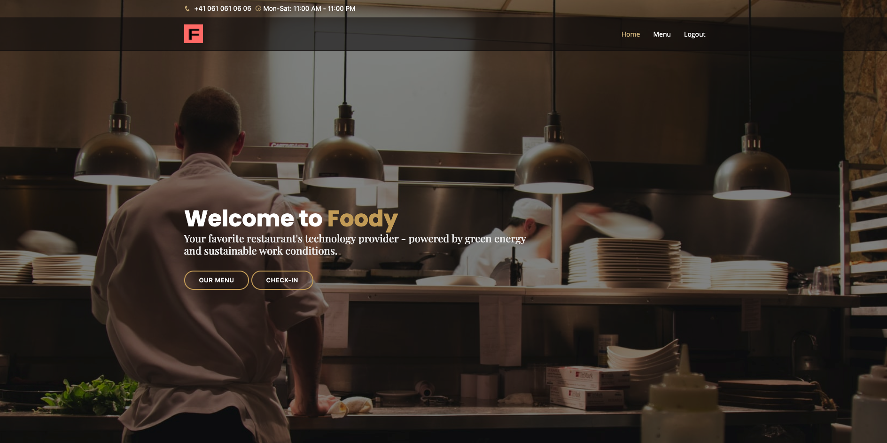

# Foody

### Software for restaurants using the Flask framework for Python

# 1 - Project Description
Welcome to Foody 🎉 

Foody is a beginner project built using the following stack:
- Flask
- Python
- SQLAlchemy
- WTForms
- HTML/CSS/JS
- Bootstrap
- Google Cloud Products
- Stripe API

<br>



<br>

Foody enables restaurant owners to offer next gen services to their clientele. Focus on the food and the unique experience you offer, while foody handles the boring stuff. For foodies, from foodies. 


<br>

# 2 - Installation & Setup
This section will describe the steps to install the foody application for a non-python user. (tbd in version 3+)

First clone foody from github

```bash
git clone https://github.com/matthiasrossini/foody.git
cd foody
```

To create a virtualenv:

```bash
pip install virtualenv
virtualenv <choose an env name> #e.g.: venv
```

To use the env on Unix:

```bash
source <env name>/bin/activate
```

To use the env on Windows: 

```bash
<env name>\Scripts\activate
```

Install the requirements:

```bash
pip install -r requirements.txt
```


# 3 - To run the app

<br>

To run the app on Unix:

```bash
cd foody && python3 run.py
```

To run the app on Windows:
```bash
cd foody && python run.py
```

<br>

# 4 - Instructions for collaboration

BEFORE STARTING
- installed application & virtualenv as specified above
- ``` git pull ```
- enter virtualenv 

1. Test pushing and pulling:
- ``` git pull ```
- #add a new file/change e.g. touch test.txt
- add all changes: ``` git add . ```
- ``` git commit -m "name's first commit" ```
- ``` git push ```

2. Working with branches
- look at available branches: ``` git branch -a``` 
- create a new branch and access it: ``` git checkout -b <branch-name> ```
- access branch: ``` git checkout ```
- check status of branch ``` git status ```
- merge branch: ``` git merge ```

<br>

# 5 - To run on Cloud

<br>

To run the app on Google Cloud, you will need a GCP Account with a running instance, bucket and SQL. 

Then branch from the main branch to the GCP branch (damian_gcp_final) and create your own secrets.py keys according to your own GCP setup. 

The keys you will need from your SQL instance are: SQL_PASSWORD, SQL_PUBLIC_IP_ADDRESS, SQL_DATABASE_NAME
e.g. SQL_PASSWORD = "password", SQL_PUBLIC_IP_ADDRESS = "00.000.000.00", SQL_DATABASE_NAME = "Foody"

Now you should be able to copy your project to your Google Cloud Server (SCP) and run it via the IP address there. Enjoy! 🎉

<br>

# 5 - Resources & Links
1. [Youtube Tutorial for Github](https://www.youtube.com/watch?v=SWYqp7iY_Tc)
2. [Youtube Tutorial for Package Structure](https://www.youtube.com/watch?v=44PvX0Yv368)
3. [Bootstrap Template](https://bootstrapmade.com/restaurantly-restaurant-template/)
